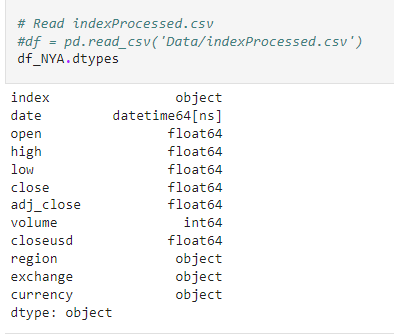
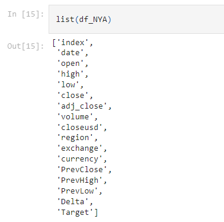
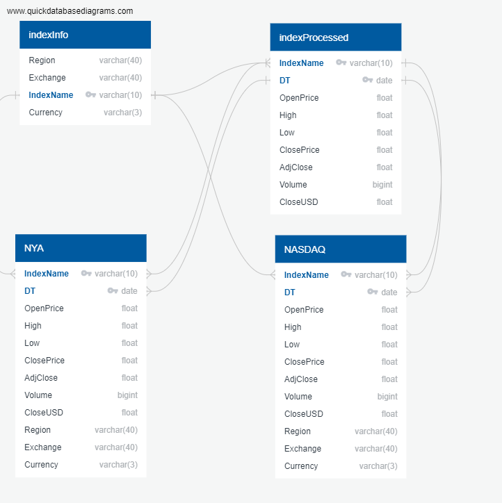

# Final_project

## Project Overview
- Topic: Predicting Whether Stock Exchange Prices will Close Higher or Lower than They Open
- Reason topic was selected: We believe that the price of the stock exchange is an indicator of general financial stability which is crucial to people's decision-making. 
- Main goal: Our goal is to use machine learning models to predict stock exchange prices to hopefully understand the level of financial stability. 
- In this project, we will be focusing specifically on the NYSE and NASDAQ, the two highest stock exchanges by market capitalization of shares traded.
- Description of their source of data: we are using a Kaggle dataset (https://www.kaggle.com/mattiuzc/stock-exchange-data) that has daily price data for indexes tracking stock exchanges from all over the world (United States, China, Canada, Germany, Japan, and more). The data was all collected from Yahoo Finance, which had several decades of data available for most exchanges. We will be focusing on 2 CSV files:
    1. A CSV with stock exchange data inclusing the columns: Stock Exchange Index, Date, Open, High, Low, Close, Adj Close, Volume
    2. A reference CSV with columns: Region, Exchange, Index, Currency
- Questions we hope to answer with the data: Based on the opening price of a particular index, will the closing price be higher or lower?

## Project Outline

### Data Cleansing and Preprocessing
In order to proceed with our project, we needed to prepare the data in a way that we could consume. Below were the initial columns:

 

We added PrevClose, PrevHigh, PrevLow to train our machine learning model. We added Delta and Target to understand if the day closed up or down (this was then used to compare against the predicted outcome). Below please find the final list of columns in our dataset:

 

Additionally we took the following steps: 

* Dropped NaN/ Nulls
* Added previous day’s High, Low, Close to today’s row
* Added Delta and Target Columns
    * Delta: % gain or loss based on Close price
    * Target: Determine Up/Down Trend based on Delta

### Database Creation
We created a SQL database which included 2 main tables - A table with open/close data for the last 60 years for all indexes and another table with reference data. From these intial tables, we created 2 additional tables that were used in the machine learning model. 

The structure of the tables can be viewed below:

 

### Machine Learning Model
We decided to go with a supervised machine learning model that would classify the data and to try to predict whether the index would go up or down based on a combination of today and yesterday's data. Over the couse fo this project, we tried 4 machine learning models:

1. Logistic Regression - This was a base level model to see where we could improve
2. Balanced Random Forest Classifier - the next 2 machine learning models try to account for a slight imbalance in data
3. SMOTE oversampling 
4. Undersampling
5. Decision Tree Model

#### Feature Selection
Following features were used: Open, PrevHigh, PrevLow, PrevClose. The features were chosen because they could improve the accuracy and help predict the directional outcome of the index. We determined that the easiest way to predict a closing value would be by using the range of values from previous day, and one's baseline from the current day. We tried other feature combinations, but ultimately these four proved to have highest accuracy. 

#### Train Test Split
We used sklearn.modle_selection library to split our data into testing and training set. And we used Oversampling and Undersampling models to reduce slight imbalance in the initial up/down. 

#### Machine Learning Model Choice
We used classification model to predict the directionality of the index. The model is less precise than linear regression model but it would provide the general indication of the up/down trend for the Index Close price. Within the five models we tried, Oversampling & Undersampling provided the highest precision, accuracy and f1 score. 

<b>Logistic Regression</b>
* Drawback: Assumes linearity between dependent and independent variables
* Success: Solid baseline!
* Scores for NYSE
    * Accuracy: 0.85
* Scores for NASDAQ
    * Accuracy: 0.62

(For logistic regression we can only report accuracy scores)

<b>Balanced Random Forest Classifier</b>
* Drawback: Value gained from additional samples drops off over time
* Success: Handles linear and non-linear relationships well!
* Scores for NYSE
    * Accuracy: 0.77
    * Precision: 0.77
    * F1: 0.77
* Scores for NASDAQ
    * Accuracy: 0.64
    * Precision: 0.64
    * F1: 0.64

<b>SMOTE Oversampling</b>
* Drawback: Overfitting more likely
* Success: Doesn't lose any information!
* Scores for NYSE
    * Accuracy: 0.87
    * Precision: 0.88
    * F1: 0.87
* Scores for NASDAQ
    * Accuracy: 0.78
    * Precision: 0.78
    * F1: 0.78

<b>Undersampling</b>
* Drawback: Potentially discarding useful data
* Success: Helps against skewing towards the majority class!
* Scores for NYSE
    * Accuracy: 0.87
    * Precision: 0.87
    * F1: 0.87
* Scores for NASDAQ
    * Accuracy: 0.77
    * Precision: 0.78
    * F1: 0.78

<b>Decision Tree Model</b>
* Drawback: Sensitive to small changes in data
* Success: Visually intuitive and efficient!
* Scores for NYSE
    * Accuracy: 0.76
    * Precision: 0.76
    * F1: 0.76
* Scores for NASDAQ
    * Accuracy: 0.63
    * Precision: 0.63
    * F1: 0.63

(There were no changes in machine learning models between segment 2 and 3)

### Visualization
To visualize the data we used a combination of exploratory data analysis before performing logistic regression and then created more visualizations after the fact. In this process we used:

1. Seaborn to create line plots and pie plots to understand the opening/closing data
2. Pyplot to produce regression plots
3. Tableau to create interactive plots to better explain and understand our data

### Presentation 
Our presentation has been created in Google Sheets and has the following slides:

1. Title
2. Big Question
3. Why we chose this topic
4. Dataset, Variables, Technology
5. Data Types & Data Cleansing
6. Dashboard
7. ER Diagram
8. Machine Learning Models - Random Forest
9. SMOTE Oversampling
10. Undersampling
11. Decision Tree Model
12. Results
13. Recommendations for Future Analysis
14. What We'd Do Differently

Link to Google Slides :
https://docs.google.com/presentation/d/18oep-1vExz-zX89DUcph0Wy5RHCpYYMkG6KXo5J1TsE/edit#slide=id.g19fc555e75fdc6a8_26

### Dashboard
We will create our dashboard using Tableau. We intend to use filters on Year, Index, and Machine Learning Model to focus on certain outcomes that we would like to highlight. (https://public.tableau.com/app/profile/michal.michael/viz/Finance_project_16468574032900/ExploratoryAnalysis?publish=yes)
